Antes de empezar a crear sitios virtuales y a discriminarlos sin saber exactamente lo que estamos haciendo debemos saber un par de cosas antes de empezar. Como por ejemplo: **¿Cuátos sitios virtuales puedo tener en mi servidor web?**

En mi servidor web puedo tener cuantos sitios virtuales siempre que su nombre DNS, puerto o IP sean distintas. Por eso discriminarlas es importante.

Al discriminarlas lo que hacemos es diferenciarla, es decir, para que no haya confusiones a la hora de acceder a ellos lo que hacemos es nombrarlas por puerto, ip o nombre dns.

En esta práctica aprenderás como crear sitios virtuales y discriminarlas.

Primero, vamos a empezar con la discriminación por puerto:

1. Para empezar, desde nuestro servidor Apache tenemos la ventana "Create Virtual Host", que nos muestra una serie de opciones marcadas por defecto:

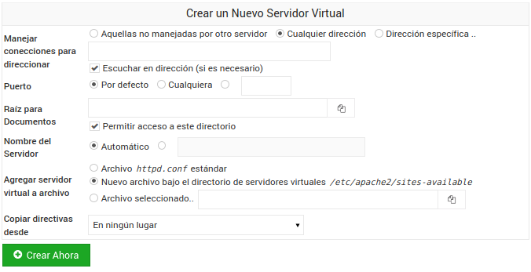

2. Una de las opciones que debemos cambiar es la de Puerto, yo he elegido el 8000.

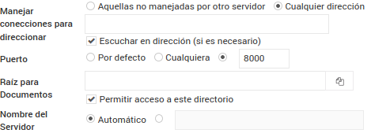

3. Ahora debemos elegir la carpeta que queremos que sea para Raíz para Documentos. Para ello crearemos una carpeta en el directorio raíz para nuestro servidor, que la llamaremos servidor*TUNOMBRE*

Dentro de ella crearemos otra carpeta llamada **puerto**, y dentro de esta un documento html llamado *index.html* con la siquiente esctructura:

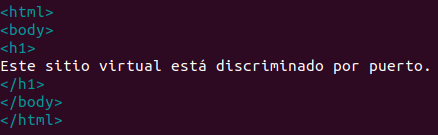

4. Ahora en Raiz para Documentos debemos escribir la ruta de nuestra carpeta, que debería ser /servidor*TUNOMBRE*/puerto.

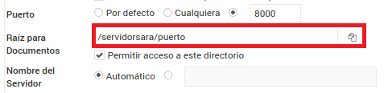

Lo que estamos haciendo en este paso es indicarle a nuestro sitio virtual que queremos que muestre el contenido de la carpeta en el sitio. 

Ahora lo que tenemos que hacer es decirle al servidor que tiene que escuchar el puerto que hemos elegido. Para ello:
  
  1. Accedemos a nuestro servidor Apache y entramos en la pestaña de *Global configuration*

  
  
  2. Nos aparecen una serie de opciones, nosotros clicamos en *Editar Archivos de Configuración* 
  
  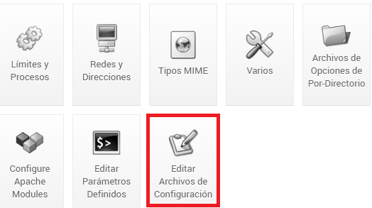
  
  3. Ahora debemos seleccionar el archivo que queremos editar, en nuestro caso  /etc/apache2/ports.conf.
  
  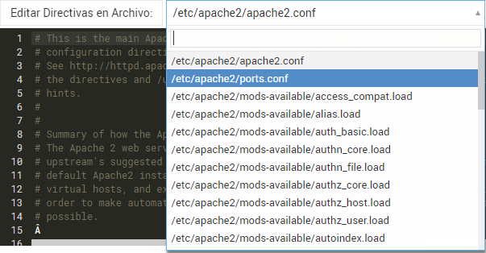
  
  4. Tenemos que añadir una línea *Listen 8000*.
  
  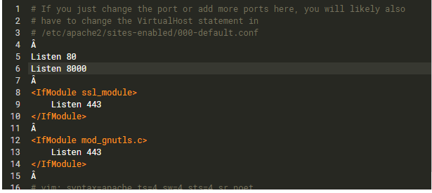
  
  Con esto le estamos indicando a nuestro servidor que debe escuchar el puerto 8000.
  
  Una vez añadido el puerto que queremos que escuche el servidor, clicamos en *Save and close*.
  
  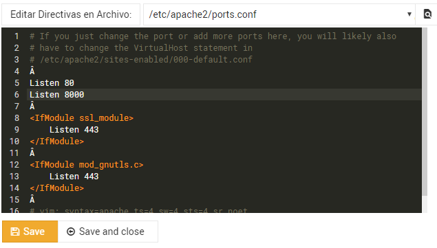
  
  Aplicamos cambios
  

Ahora que ya hemos creado un sitio virtual y hemos comprobado que funciona, vamos a crear otro sitio virtual que vamos a discriminar por nombre DNS. Para ello debemos instalar un servidor DNS. 

¿Qué es el DNS? Es un sistema de nomenclatura jerárquico que se ocupa de la administración del espacio de nombres de dominio.

¿Y como funciona un servidor DNS? A grandes rasgos, un servidor DNS funciona como nuestra agenda telefónica, guardamos un número de teléfono y le asignamos un nombre.

MIERDA DE LA INSTALACION DNS

1. Accedemos a **Red** y clicamos en *Congifuración de red*.

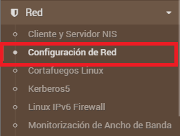

Nos aparecerán varias opciones, nosotros clicaremos en *Nombre de máquina y cliente DNS* para utilizar nuestro propio DNS.

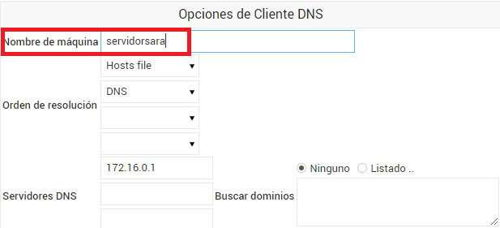

Después de guardar debemos clicar en *Aplicar Configuración*

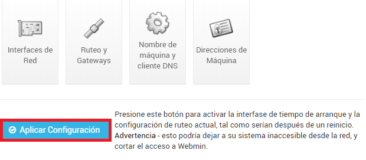

2. Solo vamos a cambiar la IP del Servidor DNS. En vez de tener la IP que nos da por defecto, tenemos que poner la IP de nuestro propio servidor.

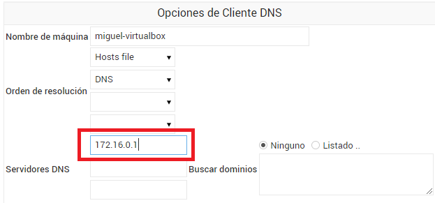

Una vez cambiada la IP guardamos los cambios.

3. Accedemos al servidor DNS y creamos una nueva zona maestra.

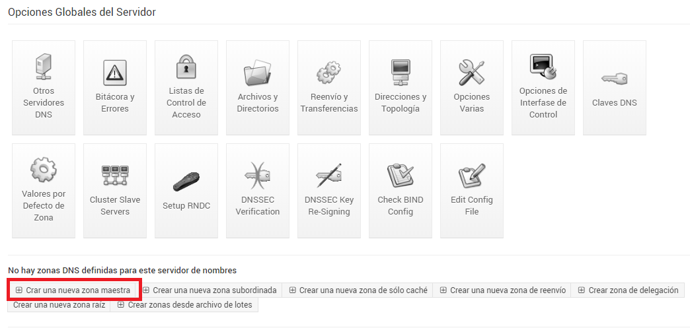

Nos cargará una serie de opciones. En *Tipo de zona* dejaremos seleccionada la opción por defecto *Reenvío*, que nos traduce los nombres a direcciones IP.

En *Nombre de Dominio/Red* escribiremos *servidorTUNOMBRE.local*

También debemos añadir un correo electrónico.

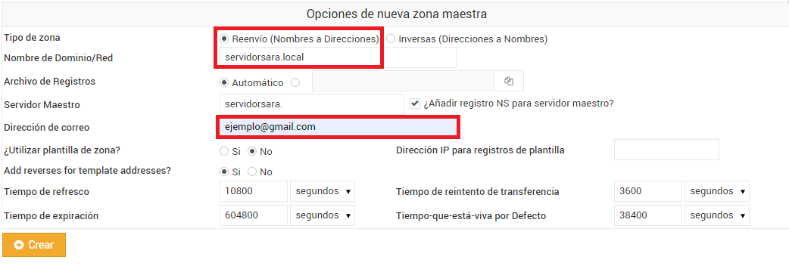

El resto de campos los dejaremos por defecto, por lo que clicamos en *Crear*

4. Ahora tenemos que configurar el servidor DNS que hemos creado. Para ello debemos:

  1. Accedemos a *Dirección* para crear un registro de dirección.
  
  
  
  2.Tenemos que rellenar los campos *Nombre* y *Dirección* para que asocie el nombre con su dirección IP.
  
  Recuerda poner la dirección IP del servidor y que el nombre sea *www*.
  
  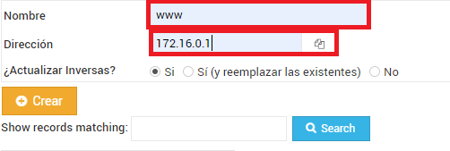
  
  3.Una vez completados los campos le damos a crear y deberá aparecer el dominio creado.
  
  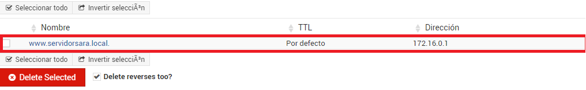
  
 5. Ahora desde nuestro servidor Apache creamos otro sitio virtual, dejaremos todo por defecto exceto los campos que se muestran en la imagen:
 
 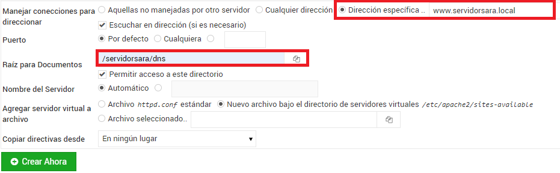
 
 Como puedes observar se debe crear otra carpeta dentro de la carpeta del servidor llamada *dns* y a su vez, dentro de ella un archivo html con la siguiente estructura:
 
 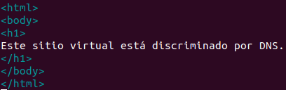
 
 Le damos a crear y aplicamos cambios.
 
 6. Ahora al ingresar en la barra de direcciones de nuestro navegador *www.servidorTUNOMBRE.local* deberá aparecernos lo siguiente:
 
 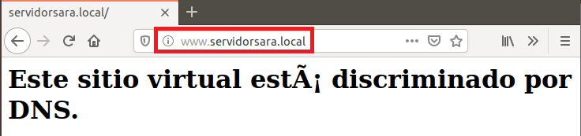
